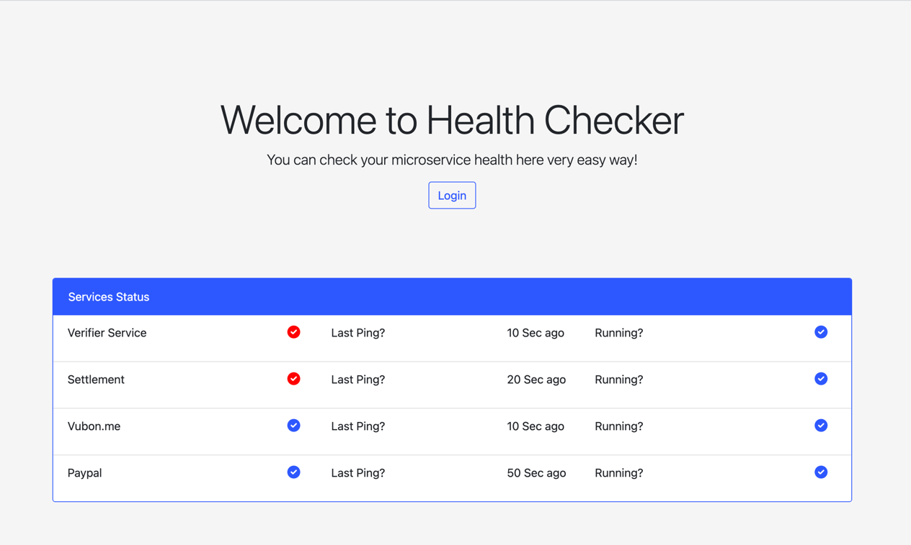
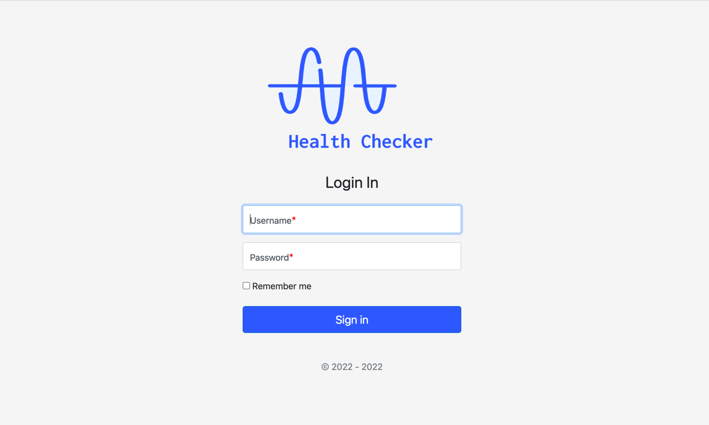
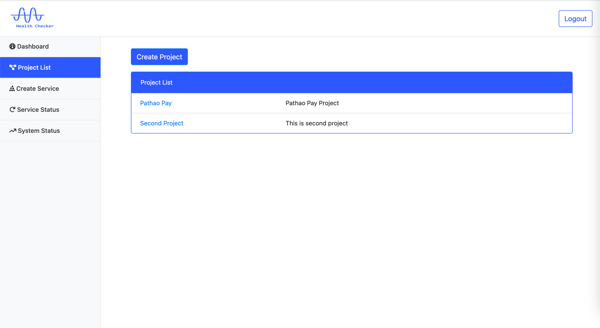
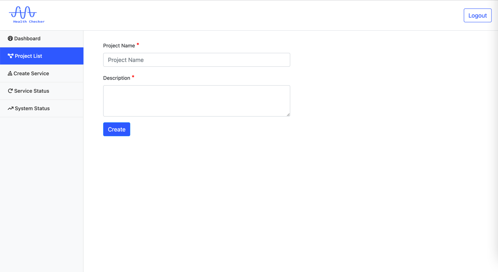
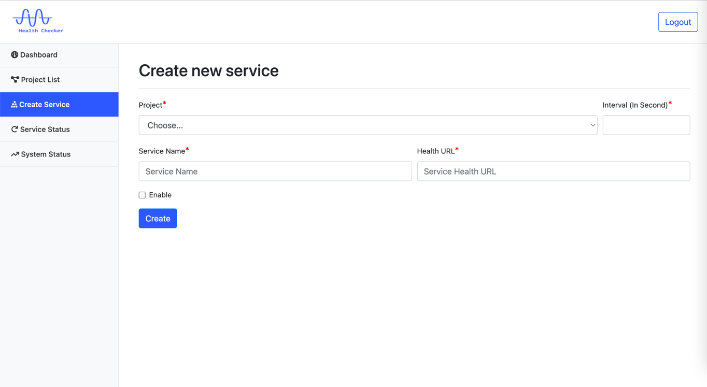
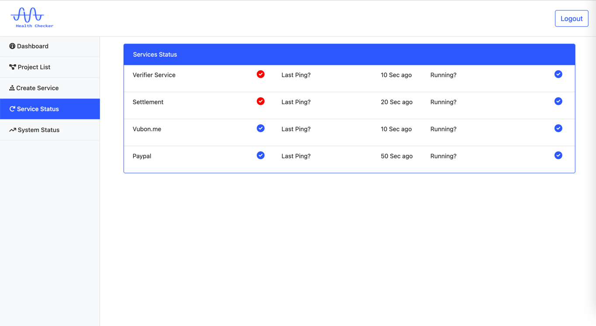
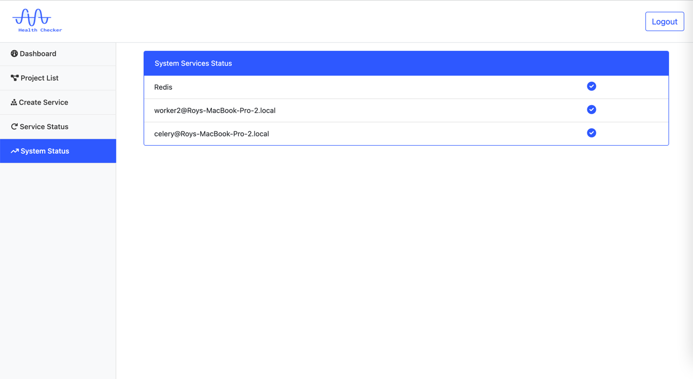

# Microservice Health Checker Project
Using the project you can check your microservice health. More interesting features are coming soon.
## Prerequisites
- Python
- Django
- Redis
- PostgreSQL

### Dashboard UI screenshots

        